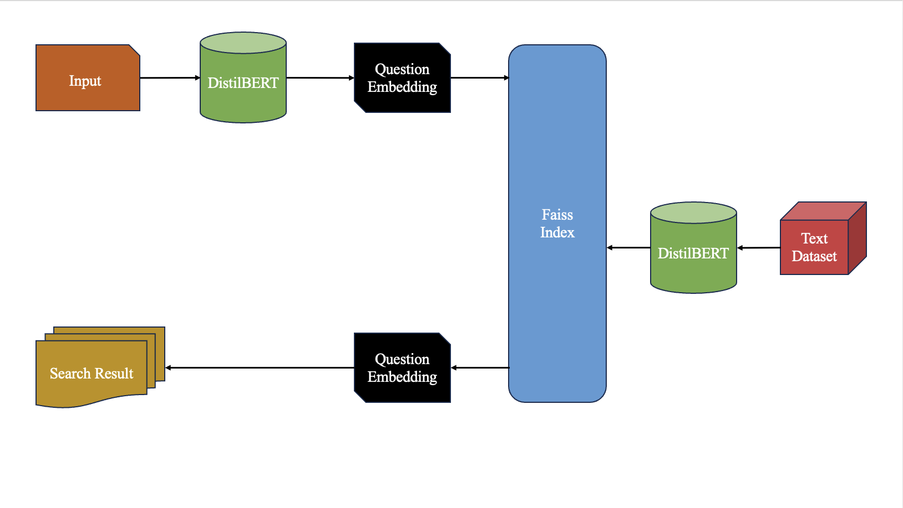
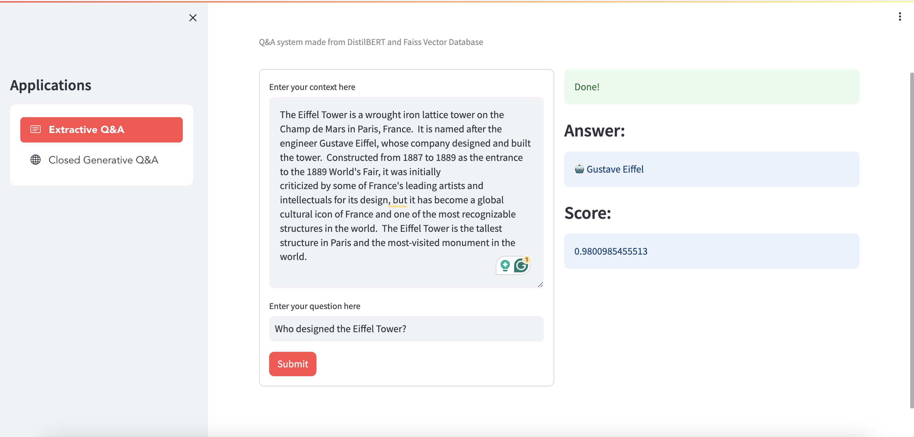
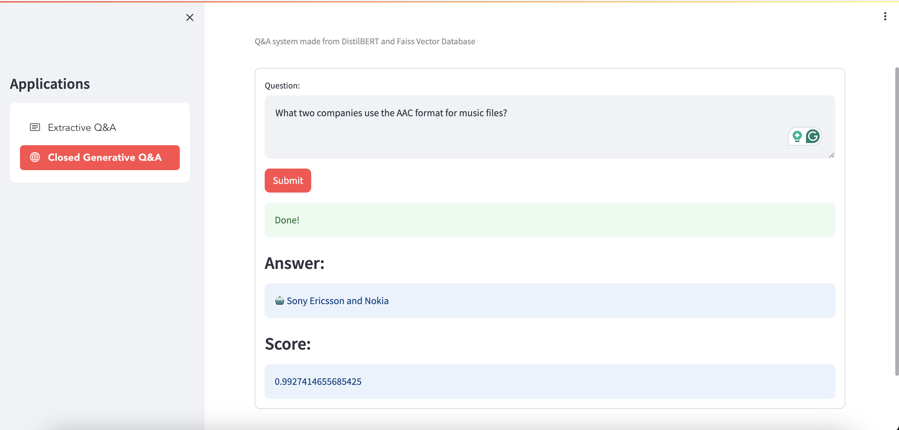

# Q&A System using BERT and Faiss Vector Database

---

### Table of Contents

- [Q\&A System using BERT and Faiss Vector Database](#qa-system-using-bert-and-faiss-vector-database)
    - [Table of Contents](#table-of-contents)
  - [Overview](#overview)
  - [Features](#features)
  - [Installation](#installation)
    - [Requirements](#requirements)
    - [Setup](#setup)
  - [Usage](#usage)
    - [Streamlit Web App Interface](#streamlit-web-app-interface)
  - [How it Works](#how-it-works)
  - [Demo](#demo)
    - [Extractive Q\&A](#extractive-qa)
    - [Closed Generative Q\&A](#closed-generative-qa)
  - [Acknowledgments](#acknowledgments)

---

## Overview

This project is a Question & Answer system implemented using DistilBERT for text representation and Faiss (Facebook AI Similarity Search) for efficient similarity search in a vector database. The system is designed to provide accurate and relevant answers to user queries by searching through a large collection of documents.

<p align = "center">
    
</p>

## Features

- **DistilBERT-based Text Representation**: Utilizes the DistilBERT model to convert questions and documents into dense vector representations.
  
- **Faiss Vector Database**: Stores the vector representations of the documents for fast similarity search.

- **Efficient Retrieval**: Finds the most relevant documents to a given question by performing efficient similarity searches in the Faiss vector database.

---

## Installation

### Requirements

- Python 3.x
- PyTorch
- Transformers
- Faiss
- Streamlit (for the web-based interface)

### Setup

1. Clone the repository:

```bash
git clone https://github.com/VuBacktracking/bert-faiss-qa-sytem.git
```

2. Clone the repository:

```bash
pip install -r requirements.txt
```

3. Train and Download the DistilBERT model:

```bash
python3 trainer.py
```

3. Build the Faiss vector database:

```bash
python3 faiss_index.py
```
<p align = "center">
    
</p>

---

## Usage

### Streamlit Web App Interface

```bash
streamlit run app.py
```

---

Open your web browser and navigate to `http://localhost:8501/` to use the web-based Q&A system.

## How it Works
  
1. **BERT Embeddings**: 
   - The preprocessed text is converted into vector embeddings using the DistilBERT model.

2. **Faiss Indexing**: 
   - The DistilBERT embeddings of the documents are indexed in the Faiss vector database.

3. **Query Processing**: 
   - When a user inputs a question, the question is converted into a DistilBERT embedding.
   - Faiss is used to find the most similar embeddings (i.e., the most relevant documents) to the question embedding.
  
4. **Answer Extraction**: 
   - The relevant documents are ranked, and the most relevant answer passages are extracted and presented to the user.

---

## Demo

### Extractive Q&A
<p align = "center">
    
</p>

### Closed Generative Q&A
<p align = "center">
    
</p>

---

## Acknowledgments

- [Hugging Face Transformers](https://github.com/huggingface/transformers)
- [Facebook AI Similarity Search (Faiss)](https://github.com/facebookresearch/faiss)